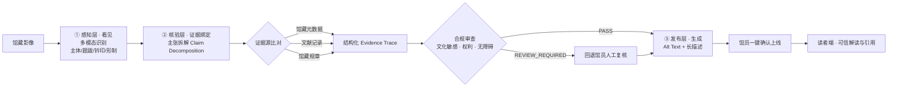

# 览卷 · CultureAccess
## 面向高校图书馆特藏的「可信发布 + 智能解读」智能体 Demo 设计与机制报告

> **一句话定位**：模型负责「看见」，证据决定「事实」——一个可公网托管、可交互演示「看见—核验—发布」三级闭环的馆藏内容可信发布原型。
>
> **交付物**：单页零依赖 Web Demo（`lanjuan/index.html` + `lanjuan/app.js`），可直接部署至 Vercel / GitHub Pages / Netlify 获得公开网址。

---

## 一、背景与痛点

高校图书馆馆藏中的古籍、特藏与历史影像承载着不可替代的学术与文化价值。数字化深入后，特色馆藏的线上发布与智能解读面临三重困境：**描述效率低**（馆员逐张撰写标题、说明与 Alt Text，成本高、周期长）；**证据缺失**（现有 AI 图像描述工具"只描述、不溯源"，生成内容难以与馆藏元数据、文献证据核验）；**合规风险**（文化敏感、权利归属、无障碍审查多凭人工经验，缺乏统一标准与留痕机制）。

本 Demo 以「证据优先」为设计原点，将上述三大痛点转化为三级闭环的技术约束：感知层只负责"看见"、核验层负责"证据绑定与合规裁决"、发布层负责"无障碍生成与留痕上线"。

## 二、系统架构：三级闭环

三级闭环的关键设计约束是 **"感知与断言分离"**：感知层输出的只是带置信度的**观察要素**（如"右下朱文方印一枚，置信度 81%"），而非事实断言；所有事实性表述必须经核验层拆解为**原子主张**并绑定证据源后，方可进入发布层。这一约束从流程上杜绝了"多模态看图说话"直接产出的风险。

## 三、核心机制与学术依据

### 3.1 主张拆解与证据绑定（Claim Decomposition & Evidence Binding）

核验层将每幅影像的描述拆解为若干原子主张，逐条对齐证据源并判定"证据支持 / 需复核"。该机制对照学界 **主张级溯源（claim-level grounding）** 范式——通过事后对齐，将每条响应主张与支持或反驳它的证据关联，从而量化响应忠实度、提升可验证性[[1](https://arxiv.org/abs/2601.03669)]。Demo 中每条主张均呈现"主张文本 → 证据来源 → 证据原文 → 归属校验"的完整链条。

### 3.2 溯源先于行文（Provenance Before Prose）

发布层不自由生成描述，而是先由核验层锁定证据源、数值与允许的语气强度，再生成连接性文字。这一"先定证据、后写文字"的顺序对照 **claim-locked reporting** 研究：在统计数据报告场景中，将证据源、数值、方向与允许的措辞强度在行文前固定，可显著提升跨运行可复现性[[2](https://arxiv.org/abs/2608.25336)]。Demo 中长描述严格分层为"形制 / 画面 / 文字 / 说明"，其中"说明"层显式声明哪些内容属待复核项。

### 3.3 证据台账裁决（Evidence-Ledger Adjudication）

对无据、矛盾或证据混杂的主张，系统不回退为沉默，而是显式标记并附复核提示，交由馆员裁决。这对照 **证据台账裁决** 工作流：为每条主张配一个证据包、赋予支持关系，并将"无据/矛盾/混杂"主张路由回作者[[3](https://arxiv.org/abs/2607.26512)]。Demo 为 3 幅样例共设置了 9 个证据源、12 条原子主张，其中含"需复核"分支以演示 REVIEW_REQUIRED 路径。

### 3.4 实体归属校验（Entity Attribution Verification）

系统不仅检查"是否有引用"，还检查"引用是否指向本藏品实体"。这针对 **欺骗性溯源（deceptive grounding）** 这一隐蔽失效模式：一段响应可能通过所有幻觉、忠实度与引用检查，却把实体 Y 的证据当作实体 X 的证据呈现[[4](https://arxiv.org/abs/2607.09349)]。Demo 在证据展示区固定输出"归属校验：指向本藏品实体 ✓"字段，将这一校验显式化。

### 3.5 文化领域多模态 RAG

馆藏影像的检索与描述以领域证据为检索源。研究表明，在低资源文化遗产场景中，检索增强能够显著提升文化术语还原度与描述的文化准确性[[5](https://arxiv.org/abs/2606.13275)]；以实体为中心、融合文本/视觉/结构化知识的检索框架，可同时提升跨模态对齐与命名实体识别表现[[6](https://arxiv.org/abs/2511.21002)]。Demo 的证据源即按"馆藏元数据 / 文献记录 / 馆藏规章"三类组织，模拟领域证据库。

### 3.6 无障碍 Alt Text 生成

发布层产出符合无障碍标准的 Alt Text 与长描述。研究指出，Alt Text 生成受限于噪声标注与标注标准不一致，而综合单点、成对与多重偏好维度、覆盖文本/视觉/跨模态因素的优化方法可取得更优效果[[7](https://arxiv.org/abs/2510.00647)]。Demo 的 Alt Text 遵循"主体 + 形制 + 色彩/关键特征"的信息结构，并以分层长描述补足屏幕阅读器场景所需细节。

## 四、Demo 交互设计

Demo 以「馆员视图 / 读者视图」双角色贯穿，对应方案中的"馆员与读者双角色交互"：

- **馆员视图**：左栏选择馆藏影像（内置古籍残卷、历史舆图、印谱册页 3 幅样例），中栏运行多模态识别并逐项呈现观察要素，右栏完成主张拆解、证据绑定、三项合规审查与发布确认。
- **读者视图**：展示经核验的解读与 **建议引用字段**，读者可查看每条事实性主张对应的证据源，实现"学术引用可直接追溯证据链"。
- **Evidence Trace 导出**：核验或发布后可一键导出 `.md` 留痕文件，覆盖感知要素、主张—证据对照、合规审查与发布产物四部分，支撑学术伦理与审计要求。

> 说明：Demo 采用纯前端实现，内置演示数据与规则库。其信息架构与三级闭环逻辑与方案所述"Dify 可视化智能体框架 + OPAC/特藏元数据库/馆藏规章知识库 + RAG"的生产架构一一对应，便于后续平滑迁移到真实后端。

## 五、实施成效与推广价值

对照方案目标，Demo 完整体现了四项创新举措：**证据优先**的内容生成机制、**内置化**的标准化合规审查、**全链路留痕**的 Evidence Trace，以及**跨行业可复制**的架构。

在推广层面，Demo 不依赖特定硬件或特殊数据环境，基于开放 Web 标准构建，部署门槛低。其核心机制可推广至所有具特色馆藏、古籍文献、历史影像数字化需求的图书馆、博物馆与档案馆，亦可作为高校信息素养教育与学术伦理课程中 AI 生成内容合规治理的教学案例工具。

## 六、部署与使用

Demo 目录 `lanjuan/` 为标准静态站点，入口为 `index.html`，无需构建、无外部依赖：

| 方式 | 操作 | 产出网址 |
|------|------|----------|
| Vercel | `vercel --prod` 或在 vercel.com/new 拖拽文件夹 | `https://xxx.vercel.app` |
| GitHub Pages | 推送仓库 + 已内置的 Actions 工作流 | `https://<用户>.github.io/<仓库>/` |
| Netlify | app.netlify.com/drop 拖拽文件夹 | `https://xxx.netlify.app` |
| 本地 | `python3 -m http.server 8080` | `http://localhost:8080` |

## 七、局限与后续工作

1. **演示数据边界**：影像为 SVG 矢量重绘、元数据与证据为样例，正式环境须接入真实 OPAC/特藏元数据库与馆藏规章知识库。
2. **感知层真实模型**：Demo 以预设观察要素模拟多模态识别输出，生产环境应接入视觉多模态模型并保留置信度原始值。
3. **合规规则库**：文化敏感与权利规则为演示级样例，需由馆方依据现行规范持续维护与版本化。
4. **无障碍复核**：Alt Text 虽遵循 WCAG 信息结构，正式发布仍建议经无障碍专项人工抽检。

---

本报告与配套 Demo 均为原型级交付，用于方案演示与评审，不代表生产系统。

## 参考文献

[1] Bohao Chu, Qianli Wang, Hendrik Damm, et al. eTracer: Towards Traceable Text Generation via Claim-Level Grounding[PP/OL]. (2026-01-07). https://arxiv.org/abs/2601.03669

[2] Xiao Fan, Jingyuan Li, Hongbin Guo, et al. Provenance Before Prose: Claim-Locked Reporting for Statistical Text Generation[PP/OL]. (2026-09-19). https://arxiv.org/abs/2608.25336

[3] Gengyu Chen, Yongjie Yu, Weiling Wang. Evidence-Ledger Adjudication for Claim-Evidence Traceability[PP/OL]. (2026-07-29). https://arxiv.org/abs/2607.26512

[4] Cedric Caruzzo, Donggeun Yoo, Tae Soo Kim. Deceptive Grounding: Entity Attribution Failure in Clinical Retrieval-Augmented Generation[PP/OL]. (2026-07-10). https://arxiv.org/abs/2607.09349

[5] Anugrah Aidin Yotolembah, Novanto Yudistira, Gembong Edhi Setyawan. Zero-Shot Captioning for Cultural Heritage: Automated Image Analysis of Traditional Indonesian Clothing[PP/OL]. (2026-06-11). https://arxiv.org/abs/2606.13275

[6] Xiaoxing You, Qiang Huang, Lingyu Li, et al. Knowledge Completes the Vision: A Multimodal Entity-aware Retrieval-Augmented Generation Framework for News Image Captioning[PP/OL]. (2025-11-26). https://arxiv.org/abs/2511.21002

[7] Jinlan Fu, Shenzhen Huangfu, Hao Fei, et al. MCM-DPO: Multifaceted Cross-Modal Direct Preference Optimization for Alt-text Generation[PP/OL]. (2025-10-01). https://arxiv.org/abs/2510.00647
